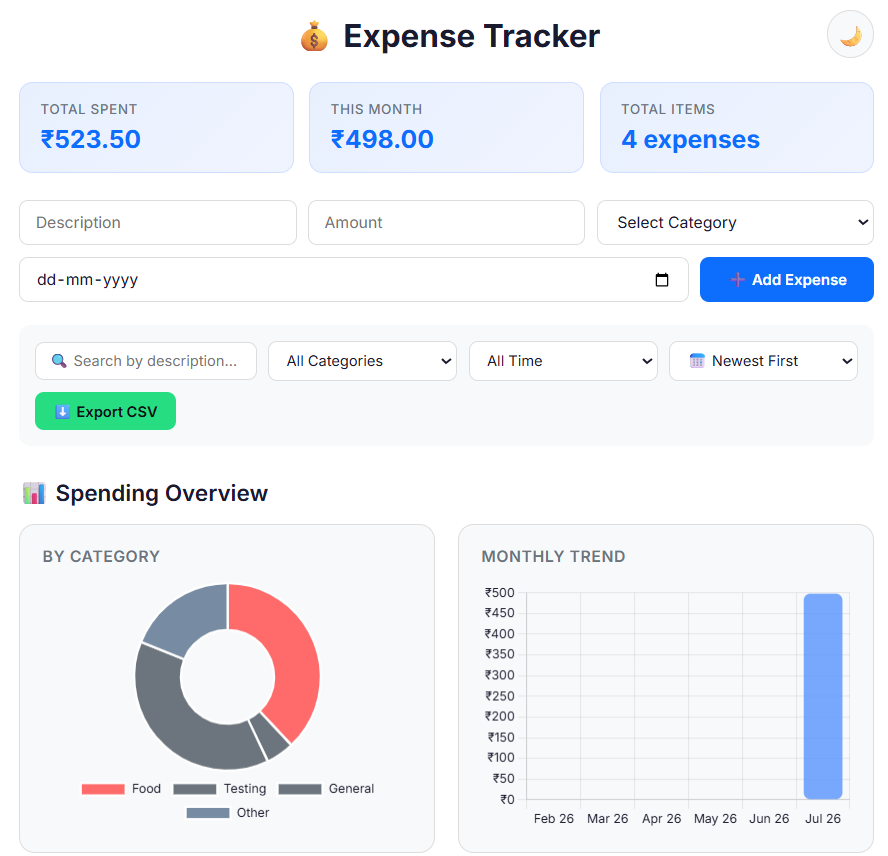
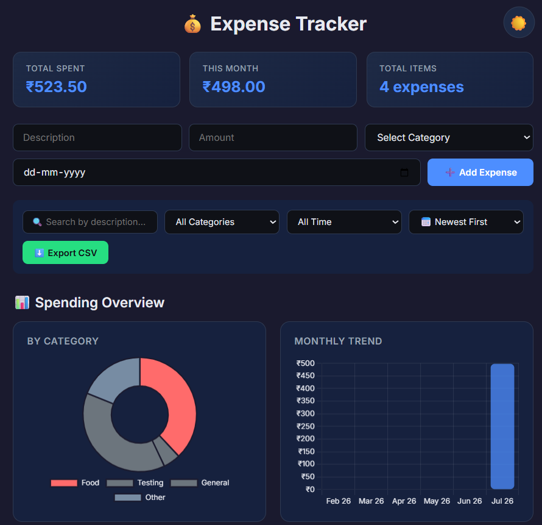
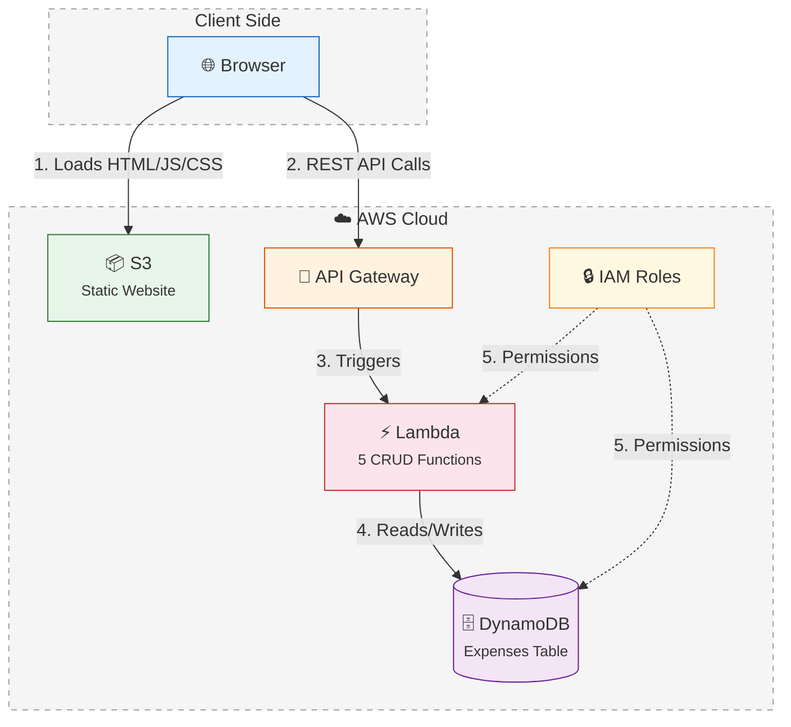

<div align="center">

# 💰 Serverless Expense Tracker

### A fully serverless expense tracking application built on AWS


<br/>

*Track your daily expenses with a beautiful, responsive UI powered by a fully serverless AWS backend. No servers to manage. No infrastructure to maintain. Just pure cloud-native architecture.*

<br/>

[Live Demo](#-live-demo) · [Architecture](#-architecture) · [Features](#-features) · [Setup Guide](#-setup--deployment) · [Team](#-team)

</div>

---

## 📸 Screenshots

<div align="center">

| Light Mode | Dark Mode |
|:---:|:---:|
|  |  |

</div>


---

## 🏗️ Architecture




| Layer | Service | Purpose |
|-------|---------|---------|
| **Frontend** | Amazon S3 | Static website hosting (HTML, CSS, JS) |
| **API** | Amazon API Gateway | RESTful API with CORS, routes requests to Lambda |
| **Compute** | AWS Lambda (Python) | Serverless functions — no servers to manage |
| **Database** | Amazon DynamoDB | NoSQL database — auto-scaling, fully managed |
| **Security** | AWS IAM | Role-based access control for all services |

---

## ✨ Features

### Core Functionality
- ➕ **Add Expenses** — Description, amount, category, and date
- 📋 **View All Expenses** — Real-time list with smooth animations
- ✏️ **Edit Expenses** — Modify any expense inline with a modal form
- 🗑️ **Delete Expenses** — Remove expenses with confirmation dialog

### UI/UX
- 🌙 **Dark Mode** — Toggle between light and dark themes
- 📊 **Dashboard Summary** — Total spent, monthly spending, expense count at a glance
- 🏷️ **Category Badges** — Color-coded categories (Food, Transport, Rent, Shopping, etc.)
- 🔍 **Search & Filter** — Filter expenses by keyword, category, or date range
- 📱 **Fully Responsive** — Works on desktop, tablet, and mobile
- 🎨 **Modern Design** — Glassmorphism cards, smooth animations, Inter font
- 🔔 **Toast Notifications** — Non-intrusive success/error messages (no ugly alerts!)
- 📈 **Charts** — Visual spending breakdown by category

### Data & Export
- 📥 **CSV Export** — Download all expenses as a spreadsheet
- 🔄 **Auto-refresh** — List updates automatically after any CRUD operation

---

## 🛠️ Tech Stack

| Component | Technology | Description |
|-----------|------------|-------------|
| **Frontend** | HTML5, CSS3, JavaScript (ES6+) | Responsive SPA with modern design |
| **Styling** | Vanilla CSS + CSS Variables | Light/dark theme support, animations |
| **Typography** | Google Fonts (Inter) | Clean, modern typeface |
| **Charts** | Chart.js | Category-wise spending visualization |
| **Backend** | AWS Lambda (Python 3.x) | 5 serverless functions for CRUD |
| **API** | AWS API Gateway | REST API with Lambda Proxy Integration |
| **Database** | AWS DynamoDB | NoSQL, on-demand capacity |
| **Hosting** | AWS S3 | Static website hosting |
| **Auth** | AWS IAM | Role-based permissions |

---

## 📁 Project Structure

```
serverless-expense-tracker/
├── fronted/                  # Frontend (Static Website)
│   ├── index.html            # Main HTML page
│   ├── app.js                # Application logic (CRUD, charts, filters)
│   └── style.css             # Complete styling (light/dark, responsive)
│
├── backend/                  # AWS Lambda Functions
│   ├── create.py             # POST   /expenses         → Add expense
│   ├── list.py               # GET    /expenses         → List all expenses
│   ├── get.py                # GET    /expenses/{id}    → Get single expense
│   ├── update.py             # PUT    /expenses/{id}    → Update expense
│   └── delete.py             # DELETE /expenses/{id}    → Delete expense
│
├── docs/                     # Documentation & screenshots
├── README.md                 # This file
└── LICENSE                   # MIT License
```

---

## 🔌 API Endpoints

| Method | Endpoint | Lambda Function | Description |
|--------|----------|-----------------|-------------|
| `GET` | `/expenses` | `listExpenses` | Retrieve all expenses |
| `POST` | `/expenses` | `createExpense` | Create a new expense |
| `GET` | `/expenses/{expenseId}` | `getExpense` | Get a specific expense |
| `PUT` | `/expenses/{expenseId}` | `updateExpense` | Update a specific expense |
| `DELETE` | `/expenses/{expenseId}` | `deleteExpense` | Delete a specific expense |

### Sample Request — Create Expense
```bash
curl -X POST https://your-api-id.execute-api.us-east-1.amazonaws.com/prod/expenses \
  -H "Content-Type: application/json" \
  -d '{
    "description": "Grocery shopping",
    "amount": 450.00,
    "category": "Food",
    "date": "2026-07-23"
  }'
```

### Sample Response
```json
{
  "id": "a1b2c3d4-e5f6-7890-abcd-ef1234567890"
}
```

---

## 🚀 Setup & Deployment

### Prerequisites

- AWS Account (Free Tier eligible)
- AWS CLI configured (optional, for testing)
- A modern web browser

### Step 1: Set Up DynamoDB

1. Go to **AWS Console → DynamoDB → Create Table**
2. Table name: `ExpenseTracker`
3. Partition key: `expenseId` (String)
4. Use default settings → **Create table**

### Step 2: Create Lambda Functions

Create **5 Lambda functions** with Python 3.x runtime:

| Function Name | Code File | Description |
|---------------|-----------|-------------|
| `createExpense` | `backend/create.py` | Handles POST requests |
| `listExpenses` | `backend/list.py` | Handles GET (list all) |
| `getExpense` | `backend/get.py` | Handles GET (single) |
| `updateExpense` | `backend/update.py` | Handles PUT requests |
| `deleteExpense` | `backend/delete.py` | Handles DELETE requests |

For each function:
- Set environment variable: `TABLE_NAME` = `ExpenseTracker`
- Attach an IAM role with `AmazonDynamoDBFullAccess` permission

### Step 3: Set Up API Gateway

1. Create a **REST API** named `ExpenseTrackerAPI`
2. Create resource `/expenses` with methods: `GET`, `POST`, `OPTIONS`
3. Create child resource `/{expenseId}` with methods: `GET`, `PUT`, `DELETE`, `OPTIONS`
4. Use **Lambda Proxy Integration** for all methods
5. **Enable CORS** on both resources
6. **Deploy** to a stage named `prod`

### Step 4: Deploy Frontend to S3

1. Create an S3 bucket with **static website hosting** enabled
2. Disable **Block Public Access**
3. Add a **bucket policy** for public read access
4. Update `API_URL` in `fronted/app.js` with your API Gateway invoke URL
5. Upload `index.html`, `app.js`, and `style.css` to the bucket

### Step 5: Access Your App! 🎉

Open the S3 bucket website endpoint URL in your browser.

---

## 🌐 Live Demo

🔗 **[http://expense-tracker-frontend-anubhav.s3-website-us-east-1.amazonaws.com](http://expense-tracker-frontend-anubhav.s3-website-us-east-1.amazonaws.com)**

---

## 💡 Key Concepts Demonstrated

| Concept | How It's Used |
|---------|--------------|
| **Serverless Computing** | No servers to provision — Lambda runs code on demand |
| **Event-Driven Architecture** | API Gateway triggers Lambda on HTTP requests |
| **NoSQL Database** | DynamoDB stores expenses as flexible JSON documents |
| **Static Website Hosting** | S3 serves the frontend without a web server |
| **RESTful API Design** | Standard CRUD operations via HTTP methods |
| **CORS** | Cross-origin requests between S3 and API Gateway |
| **IAM Security** | Least-privilege roles for Lambda ↔ DynamoDB |
| **Infrastructure as Code** | Fully reproducible cloud setup |

---

## 🔒 Security Considerations

- All Lambda functions include **CORS headers** for cross-origin support
- **IAM roles** follow least-privilege principle
- Input **validation** on both frontend and backend
- DynamoDB uses **on-demand** capacity to prevent over-provisioning
- No hardcoded credentials — uses **environment variables** and **IAM roles**

---

## 📈 Future Enhancements

- [ ] User authentication with AWS Cognito
- [ ] Monthly budget alerts via AWS SNS
- [ ] Receipt image upload via S3
- [ ] CloudFront CDN for HTTPS + faster loading
- [ ] Infrastructure as Code with AWS SAM / CloudFormation
- [ ] Automated testing with pytest

---

## 👥 Team

<div align="center">

### Team XEQT

| | Name | Role |
|:---:|------|------|
| 👑 | **Anubhav Yadav** | Team Lead · Frontend Developer |
| ⚙️ | **Arpit Verma** | Backend Developer |
| ☁️ | **Faiz Ahmad Khan** | Cloud Infrastructure & DevOps Engineer |
| 🔒 | **Ankit Roy** | Database & Cloud Security Engineer |

</div>

---

## 📄 License

This project is licensed under the **MIT License** — see the [LICENSE](LICENSE) file for details.

---

<div align="center">

**Built with ❤️ by Team XEQT**

*A minor project for AWS Cloud Computing Course*


</div>
