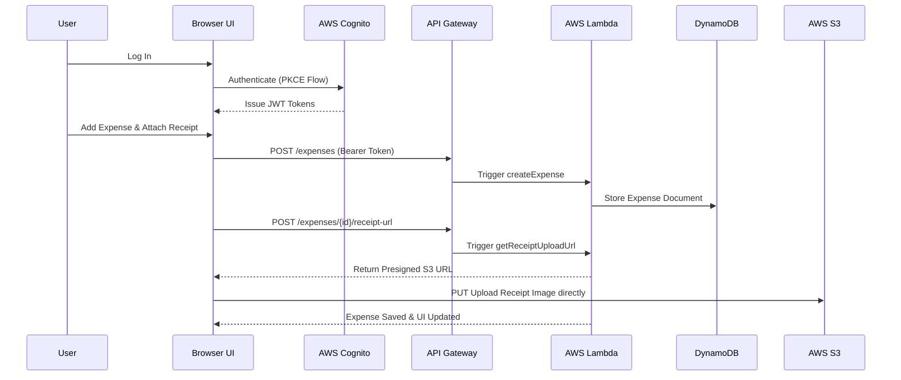
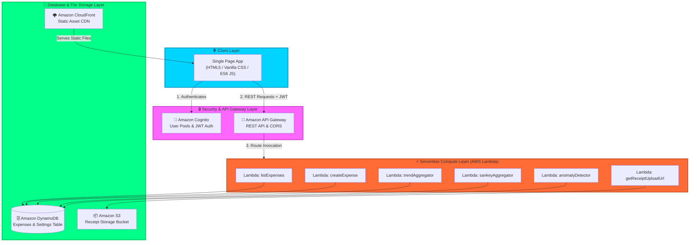
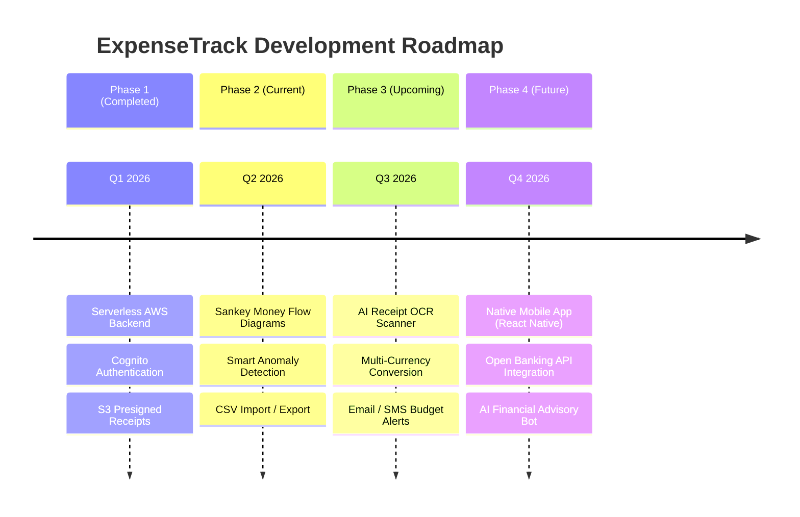

<div align="center">

# 💰 ExpenseTrack


### 💳 *A full-featured, serverless expense tracking application with advanced analytics, budget alerts, and receipt uploads*

[](https://aws.amazon.com/lambda/)
[](https://aws.amazon.com/dynamodb/)
[](https://aws.amazon.com/api-gateway/)
[](https://aws.amazon.com/s3/)
[](https://aws.amazon.com/cognito/)
[](https://aws.amazon.com/cloudfront/)
[](https://www.python.org/)
[](https://developer.mozilla.org/en-US/docs/Web/JavaScript)

---

**Master Your Personal Finances with Zero Infrastructure Overhead! 📊**

[🌐 Live Demo](https://prod.d2wuf5mzs8220o.amplifyapp.com/) • [📖 About](#-about-the-project) • [✨ Features](#-features) • [⚙️ How It Works](#️-how-it-works) • [🏗️ Architecture](#-system-architecture) • [🛠️ Tech Stack](#️-technology-stack) • [🚀 Setup](#-setup--deployment)

</div>

---

## 📖 About the Project

**ExpenseTrack** is a modern, fully serverless expense tracking platform designed to provide individuals and teams with deep financial clarity, automated budget anomaly alerts, interactive analytics charts, and seamless receipt document management.

By taking full advantage of **AWS Serverless architecture** (Lambda, DynamoDB, API Gateway, S3, Cognito), ExpenseTrack operates on-demand with zero server provisioning, automatically scaling from zero to millions of requests seamlessly while remaining virtually free for everyday personal usage.

> [!NOTE]  
> **🎯 Mission:** To empower users with effortless financial tracking, visual spending analytics, and automated budget safeguards through a blazing-fast, serverless infrastructure.

---

## 🚨 The Problem

<div align="center">

```ascii
╔══════════════════════════════════════════════════════════════╗
║        ⚠️  CHALLENGES IN PERSONAL EXPENSE MANAGEMENT         ║
╠══════════════════════════════════════════════════════════════╣
║                                                              ║
║  💸  Manual spreadsheets leading to data loss & clutter       ║
║  🧾  Lost physical receipt slips with no cloud backup       ║
║  📊  Lack of visual spending trend insights & forecasts       ║
║  ⏰  Unexpected budget overruns without real-time alerts     ║
║  🔒  Unsecured financial data on third-party servers         ║
║  🖥️  High infrastructure & server maintenance cost            ║
║                                                              ║
╚══════════════════════════════════════════════════════════════╝
```

</div>

Traditional financial apps either rely on expensive, always-on server infrastructure or store user data in fragmented, unintuitive spreadsheets. Users need a sleek, automated, and serverless solution.

---

## ✅ Our Solution

**ExpenseTrack** brings personal expense management into the cloud-native era with an all-in-one serverless web application:

<table>
<tr>
<td width="50%">

### 🎯 Core Capabilities
- 🔹 **Instant Expense Logging & Editing**
- 🔹 **Secure Direct-to-S3 Receipt Uploads**
- 🔹 **Cognito PKCE User Authentication**
- 🔹 **Interactive Spending Analytics & Sankey Diagrams**

</td>
<td width="50%">

### 🚀 Key Benefits
- ⚡ **Zero Infrastructure Cost & Server Maintenance**
- 📊 **Real-time Spending Trend & Anomaly Alerts**
- 💰 **Bulk CSV Import & Export**
- 🎨 **Glassmorphism Dark & Light Theme UI**

</td>
</tr>
</table>

---

## ✨ Features

<div align="center">

| Feature | Description |
|---------|-------------|
| 🔐 **Cognito Authentication** | Secure user registration and login powered by AWS Cognito Hosted UI (PKCE flow) |
| ➕ **Expense Management** | Full CRUD capabilities for expense description, amount, category, and custom date |
| 📎 **Direct Receipt Storage** | Upload receipt images or PDFs directly to S3 using secure pre-signed URLs |
| 📈 **Spending Trend Analytics** | Interactive daily spending line charts powered by Chart.js |
| 🥧 **Category Distribution** | Doughnut visualizers for category-wise expense breakdown |
| 🌊 **Money Flow Sankey** | Unique visual flow mapping expenses from categories to monthly totals |
| ⚠️ **Budget & Anomaly Alerts** | Custom budget targets with real-time detection of unusual spending spikes |
| 📥 **CSV Import & Export** | Bulk data export/import with automatic handling of currency symbols and BOM |
| 🌙 **Dynamic Glassmorphism UI** | Modern responsive interface with persistent Light/Dark theme toggles |

</div>

---

## ⚙️ How It Works

<div align="center">


```mermaid
sequenceDiagram
    participant User
    participant Browser UI
    participant AWS Cognito
    participant API Gateway
    participant AWS Lambda
    participant DynamoDB
    participant AWS S3

    User->>Browser UI: Log In
    Browser UI->>AWS Cognito: Authenticate (PKCE Flow)
    AWS Cognito-->>Browser UI: Issue JWT Tokens
    
    User->>Browser UI: Add Expense & Attach Receipt
    Browser UI->>API Gateway: POST /expenses (Bearer Token)
    API Gateway->>AWS Lambda: Trigger createExpense
    AWS Lambda->>DynamoDB: Store Expense Document
    
    Browser UI->>API Gateway: POST /expenses/{id}/receipt-url
    API Gateway->>AWS Lambda: Trigger getReceiptUploadUrl
    AWS Lambda-->>Browser UI: Return Presigned S3 URL
    Browser UI->>AWS S3: PUT Upload Receipt Image directly
    
    AWS Lambda-->>Browser UI: Expense Saved & UI Updated
```

</div>

### 🔄 Step-by-Step User Journey

<table>
<tr>
<td width="33%" align="center">

### 1️⃣ Secure Login
<br/>

[](https://aws.amazon.com/cognito/)

<br/>

Sign in via AWS Cognito Hosted UI using OAuth2 PKCE flow

</td>
<td width="33%" align="center">

### 2️⃣ Log Expense
<br/>

[](https://aws.amazon.com/lambda/)

<br/>

Enter description, category, amount, date, and receipt file

</td>
<td width="33%" align="center">

### 3️⃣ Presigned S3 Upload
<br/>

[](https://aws.amazon.com/s3/)

<br/>

Receipt uploaded securely directly to Amazon S3 bucket

</td>
</tr>
<tr>
<td width="33%" align="center">

### 4️⃣ Instant DB Sync
<br/>

[](https://aws.amazon.com/dynamodb/)

<br/>

Lambda persists expense details instantly into DynamoDB

</td>
<td width="33%" align="center">

### 5️⃣ Visual Analytics
<br/>

[](https://www.chartjs.org/)

<br/>

View real-time trend charts, category pie charts, and Sankey flows

</td>
<td width="33%" align="center">

### 6️⃣ Smart Alerts
<br/>

[](https://aws.amazon.com/)

<br/>

Receive automatic warnings when spending exceeds budget limits

</td>
</tr>
</table>

---

## 🏗️ System Architecture


```mermaid
flowchart TB
    subgraph Client["🌐 Client Layer"]
        Browser["Single Page App<br/>(HTML5 / Vanilla CSS / ES6 JS)"]
    end
    
    subgraph AuthAPI["🔒 Security & API Gateway Layer"]
        Cognito["👤 Amazon Cognito<br/>User Pools & JWT Auth"]
        APIGW["🔌 Amazon API Gateway<br/>REST API & CORS"]
    end
    
    subgraph Backend["⚡ Serverless Compute Layer (AWS Lambda)"]
        L_List["Lambda: listExpenses"]
        L_Create["Lambda: createExpense"]
        L_Trend["Lambda: trendAggregator"]
        L_Sankey["Lambda: sankeyAggregator"]
        L_Receipt["Lambda: getReceiptUploadUrl"]
        L_Anomaly["Lambda: anomalyDetector"]
    end
    
    subgraph Storage["💾 Database & File Storage Layer"]
        DynamoDB[("🗄️ Amazon DynamoDB<br/>Expenses & Settings Table")]
        S3Bucket["📦 Amazon S3<br/>Receipt Storage Bucket"]
        CloudFront["🌩️ Amazon CloudFront<br/>Static Asset CDN"]
    end
    
    Browser -->|1. Authenticates| Cognito
    Browser -->|2. REST Requests + JWT| APIGW
    CloudFront -->|Serves Static Files| Browser
    APIGW -->|3. Route Invocation| Backend
    L_List --> DynamoDB
    L_Create --> DynamoDB
    L_Trend --> DynamoDB
    L_Sankey --> DynamoDB
    L_Anomaly --> DynamoDB
    L_Receipt --> S3Bucket
    
    style Client fill:#00d4ff,stroke:#0099cc,stroke-width:3px
    style AuthAPI fill:#ff66ff,stroke:#cc44cc,stroke-width:3px
    style Backend fill:#ff6b35,stroke:#cc5529,stroke-width:3px
    style Storage fill:#00ff88,stroke:#00cc66,stroke-width:3px
```

---

## 🛠️ Technology Stack

<div align="center">

### 🌐 Frontend Interface


**Responsive Single-Page Application (SPA) with custom glassmorphism design system**

### ⚡ Serverless Backend & Compute


**10+ Python Lambda micro-functions backed by REST API Gateway**

### 💾 Storage & Database


**On-demand NoSQL document database and presigned S3 object storage**

### 🔒 Auth, Security & CDN


**OAuth2 PKCE user management, global HTTPS delivery, and strict IAM roles**

</div>

---

## 📂 Project Structure

```
serverless-expense-tracker/
│
├── 📁 frontend/                    # Static Web Application
│   ├── 🏠 index.html               # Single page layout (Dashboard, Analytics, Transactions)
│   ├── ⚡ app.js                    # Main application controller & state
│   ├── 📊 charts.js                 # Chart.js & Sankey chart initializers
│   ├── 🔐 auth.js                   # Cognito authentication & PKCE handlers
│   ├── ⚙️ config.js                 # API endpoints & environment constants
│   └── 🎨 style.css                 # Glassmorphism design tokens, variables & dark mode
│
├── 📁 backend/                     # AWS Lambda Python Handlers
│   ├── 🚀 create.py                # POST /expenses handler
│   ├── 📋 list.py                  # GET /expenses handler
│   ├── 🔍 get.py                   # GET /expenses/{id} handler
│   ├── ✏️ update.py                # PUT /expenses/{id} handler
│   ├── 🗑️ delete.py                # DELETE /expenses/{id} handler
│   ├── 📈 trend.py                 # GET /chart/trend analytics aggregator
│   ├── 🌊 sankey.py                # GET /chart/sankey money flow aggregator
│   ├── ⚠️ anomaly.py               # GET /alert/anomalies budget spike detector
│   ├── ⚙️ settings.py              # GET/PUT /settings budget manager
│   ├── 📎 receipts.py              # POST /expenses/{id}/receipt-url presigned URL generator
│   ├── 💰 budget.py                # Budget threshold & calculation utilities
│   └── 🛠️ common.py                # Shared responses, CORS headers, & error handling
│
├── 📁 infrastructure/              # Infrastructure as Code
│   ├── 📄 template.yaml            # AWS SAM / CloudFormation architecture definition
│   └── ⚙️ samconfig.toml           # SAM deployment configuration settings
│
├── 📁 docs/                        # Project Assets & Screenshots
│   ├── 📷 dark-mode.png            # Dark mode screenshot preview
│   └── 📷 light-mode.png            # Light mode screenshot preview
│
├── 📖 README.md                    # Main Project Documentation
└── 📄 LICENSE                      # MIT Open Source License
```

---

## 🔌 API Endpoints Reference

<div align="center">

| Method | Endpoint | Lambda Function | Description |
|:---:|:---|:---|:---|
| `GET` | `/expenses` | `listExpenses` | Retrieve all expenses for the authenticated user |
| `POST` | `/expenses` | `createExpense` | Create a new expense item |
| `GET` | `/expenses/{expenseId}` | `getExpense` | Retrieve details for a single expense |
| `PUT` | `/expenses/{expenseId}` | `updateExpense` | Update an existing expense |
| `DELETE` | `/expenses/{expenseId}` | `deleteExpense` | Delete an expense entry |
| `GET` | `/chart/trend` | `trendAggregator` | Get aggregated daily spending series |
| `GET` | `/chart/sankey` | `sankeyAggregator` | Get money flow graph between categories and months |
| `GET` | `/alert/anomalies` | `anomalyDetector` | Detect categories exceeding typical threshold |
| `GET` / `PUT` | `/settings` | `settingsController` | Get or update user budget targets |
| `POST` | `/expenses/{expenseId}/receipt-url` | `receiptUrlGenerator` | Generate presigned S3 upload URL |

</div>

---

## 🚀 Setup & Deployment Guide

### Prerequisites

- **AWS Account** (Free Tier eligible)
- **AWS CLI** configured (`aws configure`)
- **AWS SAM CLI** installed ([Install Guide](https://docs.aws.amazon.com/serverless-application-model/latest/developerguide/install-sam-cli.html))
- A modern web browser

### 1️⃣ Clone the Repository

```bash
git clone https://github.com/anubhavy-05/serverless-expense-tracker.git
cd serverless-expense-tracker
```

### 2️⃣ Deploy Infrastructure with AWS SAM

```bash
cd infrastructure
sam build
sam deploy --guided
```

> **Note:** SAM will automatically provision all AWS Lambda functions, DynamoDB tables, API Gateway routes, Cognito User Pools, S3 buckets, and IAM roles.

### 3️⃣ Configure Frontend API Endpoint

Update `frontend/config.js` with your deployed API Gateway URL and Cognito Pool IDs:

```javascript
window.CONFIG = {
  API_BASE_URL: "https://your-api-id.execute-api.us-east-1.amazonaws.com/prod",
  COGNITO_DOMAIN: "your-app-domain.auth.us-east-1.amazoncognito.com",
  CLIENT_ID: "your_cognito_client_id"
};
```

### 4️⃣ Host Frontend via S3 & CloudFront (or Local Server)

To test locally:
```bash
npx http-server frontend -p 3000
```

Open `http://localhost:3000` in your browser! 🎉

---

## 📱 Screenshots & Visual Demos

<div align="center">

### 🌙 Dark Mode Dashboard


*Sleek, modern dark mode with glassmorphic cards, KPI summaries, and interactive daily spending trend charts*

---

### ☀️ Light Mode Dashboard


*Clean, high-contrast light mode designed for maximum clarity and accessibility*

</div>

---

## 🔮 Future Enhancements

<div align="center">


```mermaid
timeline
    title ExpenseTrack Development Roadmap
    section Phase 1 (Completed)
        Q1 2026 : Serverless AWS Backend
               : Cognito Authentication
               : S3 Presigned Receipts
    section Phase 2 (Current)
        Q2 2026 : Sankey Money Flow Diagrams
               : Smart Anomaly Detection
               : CSV Import / Export
    section Phase 3 (Upcoming)
        Q3 2026 : AI Receipt OCR Scanner
               : Multi-Currency Conversion
               : Email / SMS Budget Alerts
    section Phase 4 (Future)
        Q4 2026 : Native Mobile App (React Native)
               : Open Banking API Integration
               : AI Financial Advisory Bot
```

</div>

### 🎯 Planned Features Checklist

- [x] Serverless AWS Lambda & DynamoDB Architecture
- [x] S3 Receipt Document Uploads via Presigned URLs
- [x] Budget Anomaly Detection Engine
- [ ] 🤖 **AI Receipt OCR Scanner** - Automatic item & total extraction from receipt images
- [ ] 💱 **Multi-Currency Converter** - Automatic real-time currency exchange rates
- [ ] 🔔 **SNS Email & SMS Alerts** - Instant notifications when exceeding budget limits
- [ ] 📱 **Cross-Platform Mobile App** - iOS & Android support built with React Native

---

## 💡 Key Concepts & Use Cases

<table>
<tr>
<td width="50%">

### 👨‍💼 For Individuals & Freelancers
- ✅ Track daily personal expenses effortlessly
- ✅ Keep tax-ready receipt records attached to transactions
- ✅ Monitor monthly budget targets to prevent overspending
- ✅ Export transaction logs to CSV for accountants

</td>
<td width="50%">

### ☁️ For Developers & Cloud Engineers
- ✅ Production-ready example of AWS Serverless Architecture
- ✅ Secure OAuth2 PKCE auth pattern with AWS Cognito
- ✅ Zero-server maintenance with auto-scaling DynamoDB
- ✅ Cost-efficient infrastructure operating within AWS Free Tier

</td>
</tr>
</table>

---

## 👥 Team XEQT

<div align="center">

### 👨‍💻 Development Team

| Avatar | Developer | Primary Role | Core Stack |
|:---:|:---|:---|:---|
| 👑 | **Anubhav Yadav** | Team Lead · Frontend Developer & Cloud Security | AWS Cognito, Security, UI Design |
| ⚙️ | **Arpit Verma** | Cloud Infrastructure & Backend Developer | AWS SAM, Python Lambda, API Gateway |
| ☁️ | **Faiz Ahmad Khan** | DevOps Engineer | CloudFront, S3 Deployment, CI/CD |
| 🔒 | **Ankit Roy** | Database Engineer | Amazon DynamoDB, Data Modeling |

</div>

---

## 📄 License & Support

<div align="center">

This project is open-source under the **MIT License** — see the [LICENSE](LICENSE) file for details.

### 🌟 Show Your Support

If you find **ExpenseTrack** helpful or inspiring, please consider leaving a ⭐ on GitHub!

[](https://github.com/anubhavy-05/serverless-expense-tracker/stargazers)
[](https://github.com/anubhavy-05/serverless-expense-tracker/network/members)
[](https://github.com/anubhavy-05/serverless-expense-tracker/issues)

---

### 💡 ExpenseTrack: Making Personal Finance Tracking Seamless, Smart & Secure!

**© 2026 Team XEQT | Built with ❤️ for AWS Cloud Computing**

</div>
