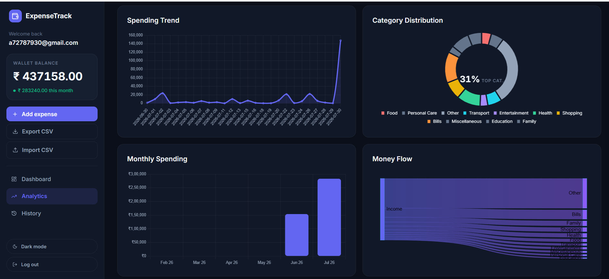
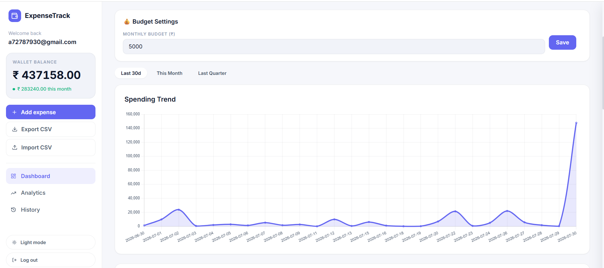
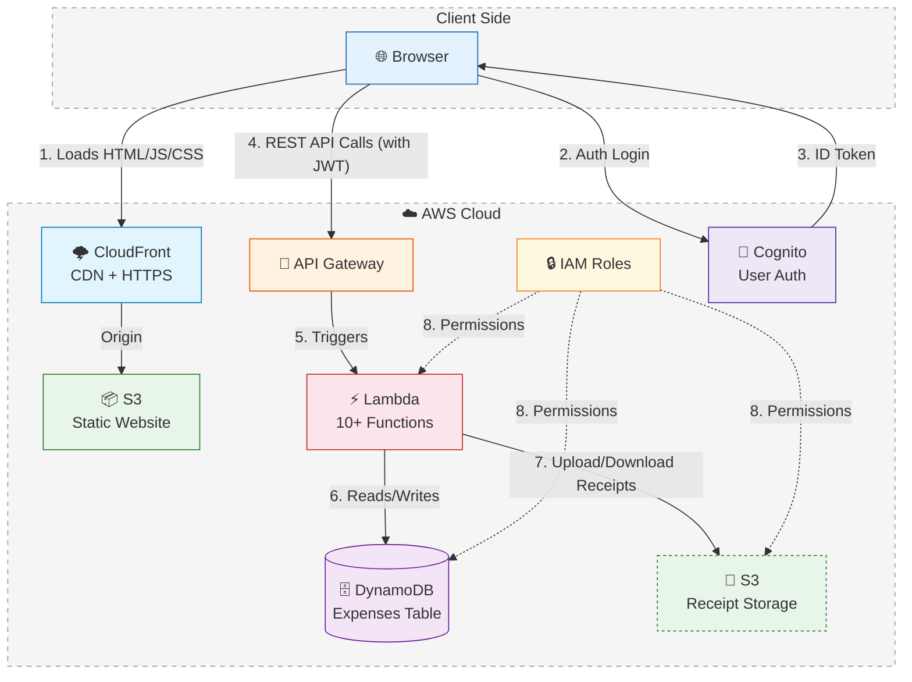

# 💰 ExpenseTrack · Serverless Expense Tracker

### A full-featured, serverless expense tracking application with advanced analytics, budget alerts, and receipt uploads


**Track your daily expenses with a beautiful, responsive UI, powerful analytics, and a fully serverless AWS backend — no servers to manage, no infrastructure to maintain.**

[**Live Demo**](https://prod.d2wuf5mzs8220o.amplifyapp.com/) · [Architecture](#-architecture) · [Features](#-features) · [Setup Guide](#-setup--deployment) · [Team](#-team)

---

## 📸 Screenshots

| Dark Mode | Light Mode |
|:---:|:---:|
|  |  |

---

## 🏗️ Architecture


```mermaid
flowchart TB
    subgraph Client[Client Side]
        Browser[🌐 Browser]
    end

    subgraph AWS[☁️ AWS Cloud]
        direction TB
        S3["📦 S3<br/>Static Website"]
        CF["🌩 CloudFront<br/>CDN + HTTPS"]
        APIGW[🔌 API Gateway]
        Lambda["⚡ Lambda<br/>10+ Functions"]
        DynamoDB[("🗄️ DynamoDB<br/>Expenses Table")]
        S3Receipt["📎 S3<br/>Receipt Storage"]
        IAM[🔒 IAM Roles]
        Cognito["👤 Cognito<br/>User Auth"]
    end

    Browser -->|1. Loads HTML/JS/CSS| CF
    CF -->|Origin| S3
    Browser -->|2. Auth Login| Cognito
    Cognito -->|3. ID Token| Browser
    Browser -->|"4. REST API Calls (with JWT)"| APIGW
    APIGW -->|5. Triggers| Lambda
    Lambda -->|6. Reads/Writes| DynamoDB
    Lambda -->|7. Upload/Download Receipts| S3Receipt
    IAM -.->|8. Permissions| Lambda
    IAM -.->|8. Permissions| DynamoDB
    IAM -.->|8. Permissions| S3Receipt

    style Browser fill:#e3f2fd,stroke:#1565c0
    style S3 fill:#e8f5e9,stroke:#2e7d32
    style CF fill:#e1f5fe,stroke:#0277bd
    style APIGW fill:#fff3e0,stroke:#e65100
    style Lambda fill:#fce4ec,stroke:#c62828
    style DynamoDB fill:#f3e5f5,stroke:#6a1b9a
    style S3Receipt fill:#e8f5e9,stroke:#2e7d32,stroke-dasharray: 3 3
    style IAM fill:#fff8e1,stroke:#f57f17
    style Cognito fill:#ede7f6,stroke:#4527a0
    style AWS fill:#f5f5f5,stroke:#9e9e9e,stroke-width:1px,stroke-dasharray: 5 5
    style Client fill:#f5f5f5,stroke:#9e9e9e,stroke-width:1px,stroke-dasharray: 5 5
```

| Layer | Service | Purpose |
|-------|---------|---------|
| **Frontend** | S3 + CloudFront | Static website hosting with HTTPS and global CDN |
| **Authentication** | Amazon Cognito | User sign-up/sign-in with JWT tokens (PKCE flow) |
| **API** | Amazon API Gateway | RESTful API with CORS, routes requests to Lambda |
| **Compute** | AWS Lambda (Python) | 10+ serverless functions for all endpoints |
| **Database** | Amazon DynamoDB | NoSQL, on-demand capacity, flexible schema |
| **File Storage** | Amazon S3 | Receipt image/PDF storage with presigned URLs |
| **Security** | AWS IAM | Least-privilege role-based access for all services |

---

## ✨ Features

### Core Functionality
- 🔐 **User Authentication** — Secure sign-up / login via Cognito Hosted UI with PKCE
- ➕ **Add Expenses** — Description, amount, category, date, and optional receipt upload
- 📋 **View & Filter** — Real-time list with search, category, and date range filters
- ✏️ **Edit Expenses** — Inline modal for fast updates
- 🗑️ **Delete Expenses** — With confirmation to prevent accidental removal
- 📎 **Receipt Management** — Attach images or PDFs; view them directly from the list

### Analytics & Insights
- 📈 **Spending Trend** — Daily spending line chart (dashboard + analytics page)
- 🥧 **Category Distribution** — Doughnut chart showing spending by category (analytics)
- 📊 **Monthly Bar Chart** — Aggregated spending per month (analytics)
- 🌊 **Money Flow Sankey** — Visual flow from categories to months (analytics)
- 🧾 **Category Breakdown** — Horizontal bars with percentages (analytics)
- 📊 **KPI Cards** — Total spent, monthly total, average daily spend, expense count

### Budget & Alerts
- 💰 **Monthly Budget** — Set a spending goal; persists in settings
- ⚠️ **Smart Anomaly Alerts** — Detects unusual category spikes compared to typical weekly spend

### Data Management
- 📥 **CSV Export** — Download all expenses as a structured CSV file
- 📤 **CSV Import** — Bulk upload expenses (handles ₹ symbols, commas, BOM)
- 🔄 **Real-time Updates** — All changes reflect instantly across the UI

### User Experience
- 🌙 **Dark / Light Theme** — Toggle with persistent preference
- 📱 **Fully Responsive** — Works on desktop, tablet, and mobile
- 🎨 **Modern Glassmorphism UI** — Inter font, smooth animations, Lucide icons
- 🔔 **Toast Notifications** — Non-intrusive success/error messages
- 📊 **Dashboard** — Clean overview with a large spending trend chart
- 📈 **Dedicated Analytics Page** — Four charts + breakdown + full transaction list

---

## 🛠️ Tech Stack

| Component | Technology | Description |
|-----------|------------|-------------|
| **Frontend** | HTML5, CSS3, JavaScript (ES6+) | Modular, responsive SPA |
| **Styling** | Vanilla CSS + CSS Variables | Light/dark theme, glassmorphism, animations |
| **Typography** | Google Fonts (Inter) | Clean, modern typeface |
| **Icons** | Lucide | Scalable, open-source icon set |
| **Charts** | Chart.js + Sankey plugin | Trend, doughnut, bar, and Sankey visualizations |
| **Backend** | AWS Lambda (Python 3.11) | Serverless functions for all endpoints |
| **API** | Amazon API Gateway | REST API with Lambda Proxy Integration |
| **Database** | Amazon DynamoDB | NoSQL, on-demand capacity |
| **Auth** | Amazon Cognito | Hosted UI with PKCE flow |
| **File Storage** | Amazon S3 | Receipt uploads and static hosting |
| **CDN** | Amazon CloudFront | HTTPS, caching, and global delivery |

---

## 📁 Project Structure

```
serverless-expense-tracker/
├── frontend/                      # Static Website
│   ├── index.html                 # Main HTML (dashboard + analytics + history)
│   ├── app.js                     # Main application logic
│   ├── charts.js                  # Chart rendering helpers
│   ├── auth.js                    # Cognito PKCE authentication
│   ├── config.js                  # Environment configuration
│   └── style.css                  # Complete styling (light/dark, responsive)
│
├── backend/                       # AWS Lambda Functions (Python)
│   ├── create.py                  # POST /expenses
│   ├── list.py                    # GET /expenses
│   ├── get.py                     # GET /expenses/{id}
│   ├── update.py                  # PUT /expenses/{id}
│   ├── delete.py                  # DELETE /expenses/{id}
│   ├── trend.py                   # GET /chart/trend (daily aggregates)
│   ├── sankey.py                  # GET /chart/sankey (flow data)
│   ├── anomaly.py                 # GET /alert/anomalies (unusual spending)
│   ├── settings.py                # GET/PUT /settings (budget)
│   ├── receipts.py                # POST /expenses/{id}/receipt-url (presigned URLs)
│   ├── budget.py                  # Budget alert calculation logic
│   └── common.py                  # Shared Lambda utilities & CORS helpers
│
├── infrastructure/                # Infrastructure as Code
│   ├── template.yaml              # AWS SAM infrastructure definition
│   └── samconfig.toml             # SAM deployment configuration
│
├── docs/                          # Screenshots and documentation
│   ├── dark-mode.png
│   └── light-mode.png
│   
│
├── README.md                      # Project documentation
└── LICENSE                        # MIT License
```

---

## 🔌 API Endpoints

| Method | Endpoint | Lambda Function | Description |
|--------|----------|-----------------|-------------|
| `GET` | `/expenses` | `listExpenses` | Retrieve all expenses (authenticated) |
| `POST` | `/expenses` | `createExpense` | Create a new expense |
| `GET` | `/expenses/{expenseId}` | `getExpense` | Get a specific expense |
| `PUT` | `/expenses/{expenseId}` | `updateExpense` | Update a specific expense |
| `DELETE` | `/expenses/{expenseId}` | `deleteExpense` | Delete a specific expense |
| `GET` | `/chart/trend?start=YYYY-MM-DD&end=YYYY-MM-DD` | `trendAggregator` | Daily spending series |
| `GET` | `/chart/sankey?start=YYYY-MM-DD&end=YYYY-MM-DD` | `sankeyAggregator` | Money flow between categories and months |
| `GET` | `/alert/anomalies` | `anomalyDetector` | Categories with unusual spending spikes |
| `GET` | `/settings` | `getSettings` | Retrieve user settings (budget, etc.) |
| `PUT` | `/settings` | `updateSettings` | Update user settings |
| `POST` | `/expenses/{expenseId}/receipt-url` | `getReceiptUploadUrl` | Generate presigned S3 upload URL |

### Sample Request — Create Expense with Receipt
```bash
# Step 1: Create expense
curl -X POST https://your-api-id.execute-api.us-east-1.amazonaws.com/prod/expenses \
  -H "Authorization: <ID_TOKEN>" \
  -H "Content-Type: application/json" \
  -d '{
    "description": "Grocery shopping",
    "amount": 450.00,
    "category": "Food",
    "date": "2026-07-23"
  }'
# Response: { "id": "a1b2c3d4..." }

# Step 2: Upload receipt
curl -X POST https://your-api-id.execute-api.us-east-1.amazonaws.com/prod/expenses/a1b2c3d4/receipt-url \
  -H "Authorization: <ID_TOKEN>" \
  -H "Content-Type: application/json" \
  -d '{"contentType":"image/jpeg","size":12345}'
# Response: { "uploadUrl": "https://s3...", "downloadUrl": "https://s3..." }

# Step 3: PUT file to uploadUrl
curl -X PUT "https://s3..." -H "Content-Type: image/jpeg" --data-binary @receipt.jpg
```

---

## 🚀 Setup & Deployment

### Prerequisites

- AWS Account (Free Tier eligible)
- AWS CLI configured with appropriate permissions
- AWS SAM CLI installed
- Node.js (for local development) – optional
- A modern web browser

### Option 1: Deploy with AWS SAM (Recommended)

1. Clone the repository:
   ```bash
   git clone https://github.com/yourusername/serverless-expense-tracker.git
   cd serverless-expense-tracker/infrastructure
   ```

2. Build and deploy:
   ```bash
   sam build
   sam deploy --guided
   ```
   Follow the interactive prompts. SAM will create all Lambda functions, DynamoDB table, API Gateway, Cognito User Pool, S3 buckets, and IAM roles automatically.

3. Note the **API Gateway endpoint URL** and **Cognito domain** from the outputs.

### Option 2: Manual Deployment

Follow the step-by-step guide in the repository. It covers:

- DynamoDB table creation
- Lambda function creation (core CRUD + analytics + receipts)
- API Gateway setup with CORS
- S3 static website hosting with CloudFront
- Cognito User Pool configuration

---

## 🌐 Live Demo

🔗 **[https://prod.d2wuf5mzs8220o.amplifyapp.com/](https://prod.d2wuf5mzs8220o.amplifyapp.com/)**

The demo is hosted on **AWS Amplify** (connected to the S3/CloudFront stack). Feel free to sign up and try all features.

---

## 💡 Key Concepts Demonstrated

| Concept | How It's Used |
|---------|--------------|
| **Serverless Computing** | Lambda runs code on demand; no servers to manage |
| **Event-Driven Architecture** | API Gateway triggers Lambda on HTTP requests |
| **NoSQL Database** | DynamoDB stores flexible JSON documents |
| **Authentication** | Cognito provides secure user identity with JWT |
| **Presigned URLs** | Secure client-side file uploads to S3 |
| **CI/CD** | SAM for infrastructure as code; CloudFront for CDN |
| **Data Visualization** | Chart.js renders interactive spending charts |
| **Responsive Design** | Single codebase adapts to all screen sizes |

---

## 🔒 Security Considerations

- All API requests require a valid **Cognito JWT** token.
- Lambda functions use **least-privilege IAM roles**.
- Receipt uploads use **presigned S3 URLs** — no credentials in client.
- Input validation on both frontend and backend.
- CORS configured to allow only trusted origins.
- DynamoDB uses on-demand capacity to prevent over-provisioning.

---

## 📈 Future Enhancements

- [ ] Multi-currency support
- [ ] Recurring expense automation
- [ ] Budget progress bar and alerts via email/SNS
- [ ] Advanced analytics with time-series forecasting
- [ ] Mobile app using React Native or Flutter
- [ ] Integration with financial APIs (e.g., Plaid)

---

## 👥 Team

### Team XEQT

| | Name | Role |
|:---:|------|------|
| 👑 | **Anubhav Yadav** | Team Lead · Frontend Developer & Cloud Security Engineer |
| ⚙️ | **Arpit Verma** | Cloud Infrastructure & Backend Developer |
| ☁️ | **Faiz Ahmad Khan** | DevOps Engineer |
| 🔒 | **Ankit Roy** | Database Engineer |

---

## 📄 License

This project is licensed under the **MIT License** — see the [LICENSE](LICENSE) file for details.

---

**Built with ❤️ by Team XEQT**

*A project for the AWS Cloud Computing Course*


````

